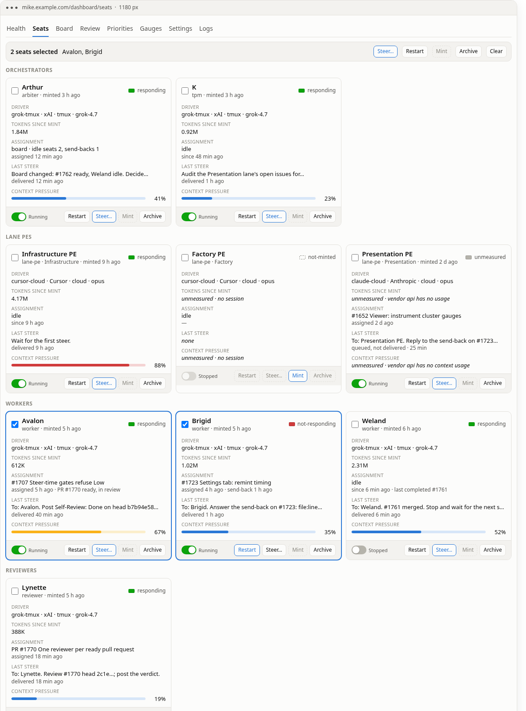
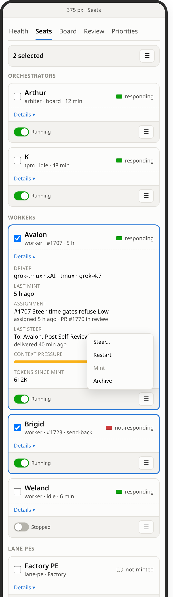
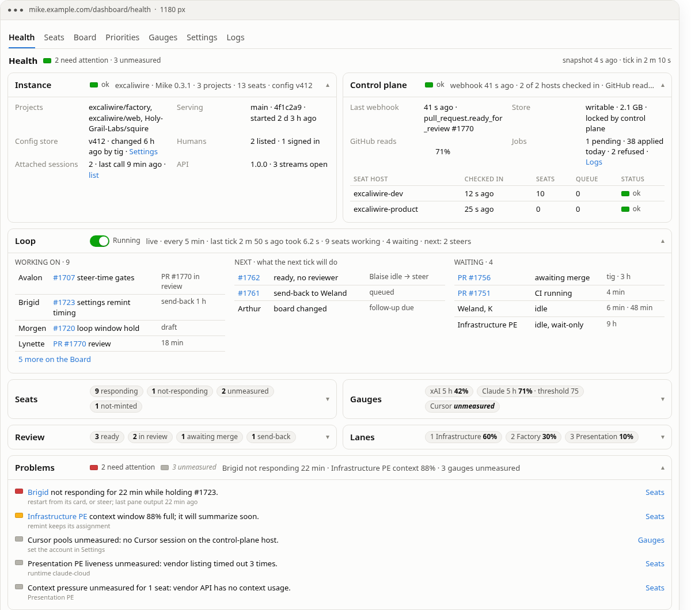
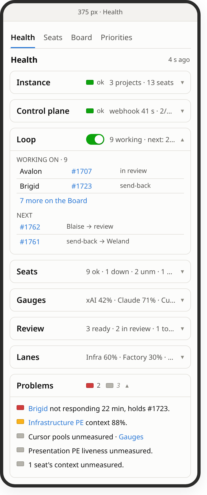
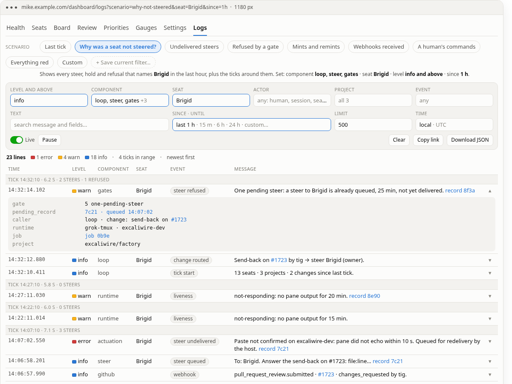
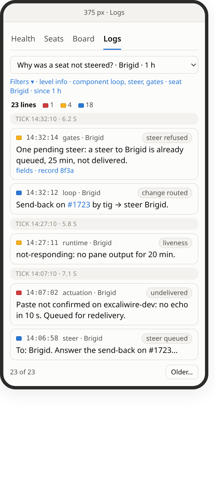
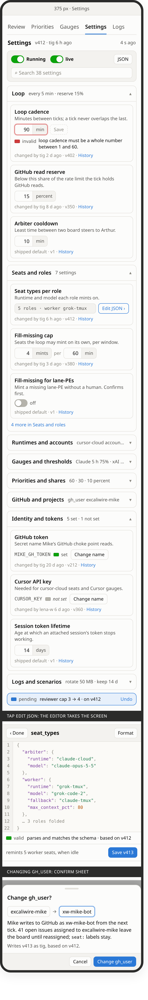

# Mike dashboard

**Status:** plan, written before the code. This is the dashboard's own spec: what the client is, what each tab shows, and the approved mockup for each. The API it speaks is [`mike-dashboard-api.md`, the dashboard API contract](mike-dashboard-api.md). The domain it shows is [`mike.md`, the Mike spec](mike.md). Each tab gets its mockup here, inline, before it is built; a tab with no mockup is not ready to build.

## 1. What the dashboard is

The dashboard is how humans see and control Mike: the fleet, the board, the priorities list, review state, gauges, settings, logs, and every verb a human may run. It is a client of the **Mike dashboard API**, and it is the only client Mike ships; an attached session or a second client speaks the same API.

**The API is Mike's own contract**, written in [`mike-dashboard-api.md`, the dashboard API](mike-dashboard-api.md). Factory's dashboard API was the starting point for that file, nothing more: parts of it were never hardened, its spec text lagged its code, and it was shaped by one client. Nothing in Mike refers to factory's contract as law. What the Mike contract must hold:

- **One version, one gate.** The API carries a semantic version. An added field is a minor bump; a removed or renamed field, a changed meaning or a changed event name is a major bump. A client reads the version first and stops, saying it must be updated, on a major it was not built for. It never draws a half-compatible page. A test fails on any schema edit that has no version bump.
- **Live by push, complete by read.** One server-sent stream carries a frame per part (version, health, seats, board, priorities, review, gauges, settings, attached sessions, logs, jobs) when that part changes, with a keep-alive so a dead stream is noticed. Every part is also a plain JSON read, so a client that cannot hold a stream still works. No message broker.
- **A command is a job.** Every command returns a job id at once and reports its outcome (applied, refused, cancelled, with the why) by stream and by read, so a slow answer still lands where a human can see it. A command the caller may not run is refused with the caller matrix's reason, not hidden.
- **Reads cost nothing.** A health or sessions read makes no vendor call, no GitHub call, and no subprocess; it serves what the loop last wrote. A part the loop has not written is absent, and the client says so. It never draws ok for a missing part, and never 0 for unmeasured.
- **Verbs come from the server.** Each seat row lists the verbs that fit it now. The client enables a verb only when every selected row lists it, and derives nothing from liveness or any other field.
- **Identity is a verified bearer.** A human, an attached session, a seat, and a seat host each carry their own token; the route says which it needs; no header names a caller.
- **Times on the wire are ISO 8601 with offset.** The client never parses human prose.

## 2. The client

**The client is a full rewrite.** Factory's dashboard is not evolved, imported, or copied from. The dashboard and UI stories and the stories the spec requires, [indexed by job in the user stories](stories/README.md), are its requirements. What it must be that factory's page is not:

- **Responsive and phone-first.** Every tab lays out at 375 px with no horizontal page scroll; every single-seat verb has a touch path; a human on a phone can read the board, steer a seat, and request a merge.
- **A review surface**: ready pull requests by urgency and age, which reviewer holds each, each verdict, and send-backs with their owner seat.
- **The board** Arthur reads, shown to humans as Arthur sees it, with target versus actual share per lane and each row's note.
- **Gauges per runtime** with the mint threshold drawn against them, and unmeasured shown as unmeasured.
- **Attached sessions** on their own list with last call and token age, and a Revoke verb.
- **Edits survive a frame.** What a human is typing is never overwritten by a live update; the page diffs, it does not repaint.
- **Every command's outcome is visible** on the row it changed, however long it took.

## 3. The Seats tab and the seat card

The tab factory calls Sessions is the **Seats** tab in Mike. It shows every seat as one **seat card**, a single shared component, rendered the same way wherever a seat appears. Tig approved the mockup below on 2026-10-06. Its source is [`mockups/seat-card.html`, the seat card at desktop and phone widths](mockups/seat-card.html); open it to click the expander, the hamburger and the switch.

- **Card groups.** Cards sit in groups by role: orchestrators, lane-PEs, workers, reviewers. A group lays its cards out responsively: side by side at desktop widths, stacked at phone widths. The card's own inside is responsive too, by its container width, not the viewport's.
- **Info on top.** Name and role; liveness as a rectangular LED (green responding, red not-responding, gray unmeasured with the reason on hover, hollow not-minted) always beside its word, never color alone; the driver as runtime, vendor, access method and model; last mint; the assignment with the time it was assigned; the last steer, clipped, with the time it was delivered or that it is queued; context pressure as a bar gauge whose fill turns warning and then critical as the window fills; tokens since mint. An unmeasured value draws the word unmeasured and its reason, never 0 and never an empty bar.
- **Controls on the bottom.** A slider switch for start and stop, then Restart, Steer, Mint, Archive. A verb the row's `verbs` list does not carry is drawn disabled with the server's `verb_why` as its hover text; the client derives nothing.
- **Multi-select.** Each card has a checkbox; a selected card is outlined; a selection bar at the top of the tab names the selected seats and offers a verb only when every selected row lists it.
- **Phone.** Everything below the card's header collapses behind a Details expander; the four verbs collapse behind a hamburger menu; the start-stop switch stays visible. The selection bar's verbs sit behind a hamburger too. No horizontal page scroll at 375 px.
- **Live.** A card updates from the seats frame without a repaint of the tab, and an open expander, an open menu, or a half-typed steer survives the frame.

### 3.1 Desktop, 1180 px

### 3.2 Phone, 375 px

## 4. The Health tab

**Proposed 2026-10-06; revised the same day on Tig's riff (Problems last and folding at zero, Lanes as set percents).** Health is the one-screen answer to "is Mike well, and what is it doing". It duplicates no other tab and holds no log; the log is the Logs tab. It is a summary with expanders: each section is one line when closed and opens for detail, and every expander links to the tab that owns the detail. Source: [`mockups/health.html`, the Health tab at desktop and phone widths](mockups/health.html).

The sections, top to bottom:

- **Top line.** Snapshot age and time to the next tick, and the attention count: "N need attention · M unmeasured".
- **Instance.** One line: instance name, Mike version, project count, seat count, config version. Open: the projects, the serving commit and start time, the config store version with who changed it, humans listed and signed in, attached sessions, API version and open streams.
- **Control plane.** One line: last webhook age, seat hosts checked in, GitHub reads left. Open: the last webhook event, the store state, the GitHub read reserve as a meter, jobs pending, applied and refused, and a seat-host table (checked in, seats, queue, status).
- **Loop.** One line: the Running/Paused switch, live or dry-run, cadence, last tick age and duration, counts of seats working and waiting, and what the next tick will do. Open, three columns: **Working on** (seat, assignment, state, the first few with a link to the Board for the rest), **Next** (what the next tick will do: a ready pull request to a named idle reviewer, a send-back to its owner, a follow-up due to Arthur), **Waiting** (pull requests awaiting merge or CI, idle seats with their idle time).
- **Rollups**, closed by default, each a one-line summary with chips: **Seats** (liveness counts; open: a stacked bar of context pressure under 60, 60 to 80, over 80 percent, and fleet tokens since mint), **Gauges** (per runtime percent with its mint threshold as a tick mark; unmeasured shown as the word), **Review** (ready, in review, awaiting merge, send-backs; oldest unreviewed), **Lanes** (the priorities list as set: rank, lane, share percent; a reminder of how priorities are set, not a measurement, so no actual versus target here; that lives on the Priorities tab).
- **Problems**, last. One line with the counts; at zero it is that one line, "nothing needs attention", and nothing more. Open: one line per problem with the LED, the subject linked to its card, a one-clause consequence, a small line of what to do, and a link to the owning tab. It is a list of things a human must act on now, with a fixed shape per line; it never carries log text and never grows into a log.

### 4.1 Desktop, 1180 px

### 4.2 Phone, 375 px

## 5. The Logs tab

**Proposed 2026-10-06, awaiting Tig's word.** One log, two layers of filter. Source: [`mockups/logs.html`, the Logs tab at desktop and phone widths](mockups/logs.html).

- **Scenario selector**, the high-level layer. A row of named presets for the common diagnostic questions: Last tick; Why was a seat not steered?; Undelivered steers; Refused by a gate; Mints and remints; Webhooks received; A human's commands; Everything red. Picking one fills the low-level filter and says, in one line under the row, what it set and for whom. A scenario that needs a subject (a seat, a human) asks for it. Editing the filter afterwards turns the chip to Custom. A human can save the current filter as a new scenario; scenarios are config, human-only, and ship with Mike's defaults.
- **Filter**, the low-level layer, full control: level and above; component (multi-select); seat; actor (human, attached session, seat, loop); project; event; free text over message and fields; since and until with presets (15 m, 1 h, 6 h, 24 h, custom); limit; local or UTC. A set field is outlined. Live follows the stream; Pause stops the scroll, not the stream. Clear, Copy link, Download JSON. The whole filter is in the URL, so a view is a link that a problem line on Health or an issue comment can carry ([the dashboard API, logs read and filters](mike-dashboard-api.md#5-reads)).
- **Lines.** Newest first: time (monospace), level as an LED with its word, component, seat, event as a chip, message. A count line above says how many lines and how many per level, and how many ticks the range covers. Tick boundaries are thin separators naming the tick's start, duration, steers and refusals. A line expands to its fields as key and value, with links to its decision record, its job, and the issue or pull request it names. Older pages load on demand.
- **Phone.** The scenario row becomes a select; the filter sits behind a Filters expander whose summary line shows what is set; lines are cards with time, level, component and seat on the first line and the message under it, fields behind an expander.

### 5.1 Desktop, 1180 px

### 5.2 Phone, 375 px

## 6. The Settings tab

**Proposed 2026-10-06, awaiting Tig's word.** The config store, editable. Source: [`mockups/settings.html`, the Settings tab at desktop and phone widths](mockups/settings.html). What factory's tab got wrong and this one fixes, from Tig's review: numbers had no units, the page was not responsive, a From column said nothing once every setting lived in the store, and JSON was edited in a one-line box.

- **Top line.** Config store version, setting and group counts, last change and by whom, snapshot age. Then the two switches that are human switches in the spec, **Running / Paused** and **live / dry-run**, each with one clause of consequence beside it; a search box over keys, labels and help; **View all as JSON**; **Reset defaults…**.
- **Groups**: Loop; Seats and roles; Runtimes and vendor accounts; Gauges and mint thresholds; Priorities and shares; GitHub and projects; Identity and tokens; Logs and scenarios. On desktop a group list on the left with counts and one group open in the middle; on a phone each group is an expander with a one-line summary.
- **A setting row**: label and key, one line of help, the control with its **unit as part of the control** (5 min, 24 h, 75 %, 4 mints per 90 minutes), and a small line "changed by <login>, <ago> · v<version> · History". There is **no From column**. A secret shows its name and set or not set, never its value. A `choice` is a select; a boolean is a switch.
- **Validation before save**, inline under the row: "worker cap must be a whole number between 1 and 40. Nothing saved." Save stays disabled until the value passes the setting's `range`.
- **Saves are versioned.** A row shows "pending · based on v412" while it saves; a save that collides with another human's newer version is refused and the row says "not saved: <login> saved v413 <ago> (<old> → <new>)" with **Compare** and **Use v413**; the human's edit is kept in the field.
- **JSON settings open in a real editor**: monospace, line numbers, syntax coloring, pretty-printed, **Format** and **Revert**, the error named by line and column, Save disabled until the document parses and matches the setting's schema, and one line of consequence beside Save ("remints 5 workers, when idle"). Beside the list on desktop; full screen with Done on a phone.
- **Confirms for dangerous changes**, each stating the exact consequence in Mike's numbers: switching the loop to live; changing `gh_user`; turning on fill-missing for lane-PEs; Reset defaults. The dialog names what it writes and how to undo it.
- **Versions drawer** per setting: version, from → to, by, when, and **use**, which fills the field and saves only through Save.
- **View all as JSON**: a pretty-printed, copyable dump of every effective value with its version; secrets by name only.

The setting keys in the mockup are illustrative where Mike's spec does not yet name one (`remint_timing`, `worker_cap`, `reviewer_cap`, the arbiter cooldown, the session token lifetime); the config store schema is the law for keys.

### 6.1 Desktop, 1180 px

### 6.2 Phone, 375 px

## 7. Tabs still to mock up

Board, Review, Priorities, Gauges, Attached sessions. Each lands here with a desktop and a phone image before its stories are built ([the user stories index](stories/README.md)).
